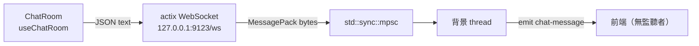

# Gossip 事件與通訊流程

本文件描述**目前程式碼實際的行為**。目標設計（WS Hub、廣播、CloudEvent 事件協定、邀請連結）還沒實作，記錄在 Notion 的 Gossip 頁面與 Product Design 頁面；實作後再搬進這裡。

## 通訊管道

目前前後端之間有三條管道：

| 管道 | 方向 | 實作位置 | 狀態 |
|---|---|---|---|
| Tauri command（`invoke`） | 前端 → Rust | `src-tauri/src/commands/` | 見 [API 文件](./api/README.md) |
| WebSocket `ws://127.0.0.1:9123/ws` | 前端 → Rust | `src-tauri/src/application/infrastructure/server/route.rs` | 只收不送 |
| Tauri event `chat-message` | Rust → 前端 | `src-tauri/src/main.rs` | 有 emit，但前端沒有監聽 |



### WebSocket 訊息格式

```typescript
// 對應 route.rs 的 WsMessage
interface WsMessage {
  message_type: string; // 目前前端送 'join' 或 'chat'
  content: string;
  sender: string;       // 前端目前寫死為 'System' 或 'You'
}
```

- 後端接受 MessagePack 二進位 frame；也接受 JSON text frame，並轉成 MessagePack。
- 前端（`useChatRoom`）目前送的是 JSON text。
- server 只綁 `127.0.0.1`，同一台電腦以外連不進來。
- server 收到後**不會回送或廣播**給任何 WebSocket client，只把 MessagePack bytes 轉給本機視窗的 `chat-message` event。

### 前端現有的監聽（都收不到東西）

| 位置 | 監聽 | 為什麼收不到 |
|---|---|---|
| `useChatRoom` 的 `ws.onmessage` | WebSocket 回送 | server 從不回送 |
| `useChatMessages` | Tauri event `chat-message-msgpack` | 後端 emit 的名稱是 `chat-message`；而且這個 hook 沒有被任何元件使用 |
| `App.tsx` | Tauri event `receive-message` | 沒有任何地方 emit |

## 功能流程

- [建立聊天室](./events/create-room.md)

加入聊天室、發送訊息、老闆警示目前都沒有跨機器的流程；它們在前端本機的行為記錄在 `CLAUDE.md` 的「已知問題」。
