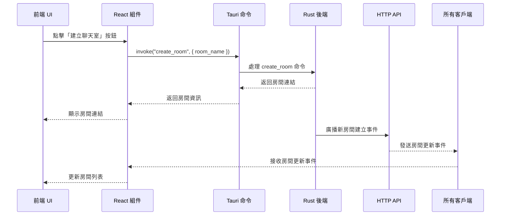

# 建立聊天室事件流

## 概述

本文檔詳細說明了用戶點擊「建立聊天室」按鈕後，系統中的完整事件流程。

## 事件流程圖



## 詳細流程

### 1. 前端觸發

```typescript
// src/components/CreateRoomButton.tsx
const CreateRoomButton = () => {
  const handleCreateRoom = async () => {
    try {
      // 1. 獲取房間名稱
      const roomName = await promptRoomName();

      // 2. 調用 Tauri 命令並獲取房間資訊
      const roomInfo = await invoke<RoomInfo>("create_room", {
        room_name: roomName,
      });

      // 3. 顯示房間連結
      setRoomLink(roomInfo.link);

      // 4. 顯示成功提示
      toast.success("聊天室建立成功！");
    } catch (error) {
      // 5. 錯誤處理
      toast.error("建立聊天室失敗：" + error.message);
    }
  };

  return <Button onClick={handleCreateRoom}>建立聊天室</Button>;
};
```

### 2. Tauri 命令處理

```rust
// src-tauri/src/commands/room.rs
#[derive(serde::Serialize)]
pub struct RoomInfo {
    pub id: String,
    pub name: String,
    pub link: String,
}

#[tauri::command]
pub async fn create_room(
    room_name: String,
    state: State<'_, AppState>,
) -> Result<RoomInfo, String> {
    // 1. 驗證房間名稱
    if room_name.is_empty() {
        return Err("房間名稱不能為空".to_string());
    }

    // 2. 生成房間 ID
    let room_id = generate_room_id();

    // 3. 創建房間連結
    let room_link = format!("gossip://chat/{}", room_id);

    // 4. 創建新房間
    let room = Room::new(room_name.clone(), room_id.clone());

    // 5. 將房間添加到狀態中
    state.rooms.lock().await.insert(room_id.clone(), room);

    // 6. 廣播房間更新事件
    state.broadcast_room_update().await?;

    // 7. 返回房間資訊
    Ok(RoomInfo {
        id: room_id,
        name: room_name,
        link: room_link,
    })
}

fn generate_room_id() -> String {
    use rand::{thread_rng, Rng};
    let mut rng = thread_rng();
    let id: u64 = rng.gen();
    base64::encode(id.to_string())
        .chars()
        .take(8)
        .collect()
}
```

### 3. 後端狀態管理

```rust
// src-tauri/src/state.rs
pub struct AppState {
    pub rooms: Arc<Mutex<HashMap<String, Room>>>,
    pub tx: Sender<Message>,
}

impl AppState {
    pub async fn broadcast_room_update(&self) -> Result<(), String> {
        // 1. 獲取當前房間列表
        let rooms = self.rooms.lock().await;
        let room_list: Vec<RoomInfo> = rooms
            .iter()
            .map(|(id, room)| RoomInfo {
                id: id.clone(),
                name: room.name.clone(),
                link: format!("gossip://chat/{}", id),
            })
            .collect();

        // 2. 創建更新消息
        let message = Message::RoomUpdate(room_list);

        // 3. 發送消息
        self.tx.send(message).map_err(|e| e.to_string())?;

        Ok(())
    }
}
```

### 4. HTTP API 處理

```rust
// src-tauri/src/api.rs
async fn handle_receive(
    req: HttpRequest,
    payload: web::Payload,
    srv: web::Data<Addr<Server>>,
) -> Result<HttpResponse, Error> {
    // 1. 接收消息
    let message = payload.to_str()?;

    // 2. 解析消息類型
    match message {
        "ROOM_UPDATE" => {
            // 3. 廣播房間更新事件
            srv.send(BroadcastMessage {
                message: message.to_string(),
            })
            .await?;
        }
        _ => return Ok(HttpResponse::BadRequest().finish()),
    }

    Ok(HttpResponse::Ok().finish())
}
```

### 5. 前端事件處理

```typescript
// src/hooks/useRooms.ts
interface RoomInfo {
  id: string;
  name: string;
  link: string;
}

export const useRooms = () => {
  const [rooms, setRooms] = useState<RoomInfo[]>([]);

  useEffect(() => {
    // 1. 監聽房間更新事件
    const unlisten = listen("room-update", (event) => {
      // 2. 更新房間列表
      setRooms(event.payload as RoomInfo[]);
    });

    // 3. 清理監聽器
    return () => {
      unlisten.then((fn) => fn());
    };
  }, []);

  return rooms;
};
```

## 錯誤處理

### 1. 前端錯誤

- 房間名稱驗證
- 網絡請求錯誤
- 事件監聽錯誤
- 房間連結生成錯誤

### 2. 後端錯誤

- 房間創建失敗
- 狀態更新失敗
- 廣播失敗
- ID 生成衝突

## 性能考慮

1. **狀態管理**

   - 使用 React 狀態管理房間列表
   - 避免不必要的重渲染

2. **事件處理**

   - 使用防抖處理快速點擊
   - 優化事件監聽器

3. **資源管理**
   - 及時清理事件監聽器
   - 釋放未使用的資源

## 安全性考慮

1. **輸入驗證**

   - 房間名稱格式驗證
   - XSS 防護

2. **權限控制**

   - 房間創建權限
   - 訪問控制

3. **ID 生成**
   - 使用加密安全的隨機數生成器
   - 避免 ID 衝突

## 最佳實踐

1. **用戶體驗**

   - 即時反饋
   - 錯誤提示
   - 加載狀態
   - 房間連結複製功能

2. **代碼組織**
   - 模塊化設計
   - 清晰的錯誤處理
   - 可維護的狀態管理
