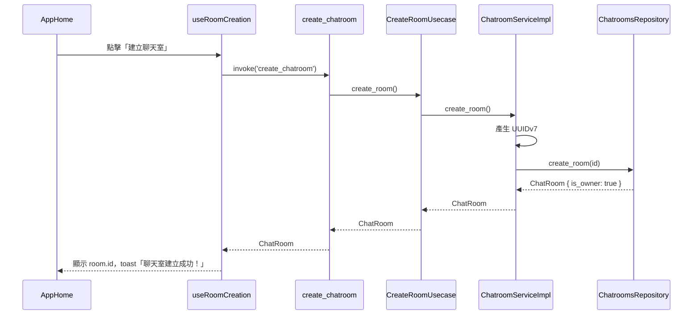

# 建立聊天室

描述使用者在首頁按下「建立聊天室」後，目前實際發生的事。

## 流程

```mermaid
sequenceDiagram
    participant UI as AppHome
    participant Hook as useRoomCreation
    participant Cmd as create_chatroom
    participant UC as CreateRoomUsecase
    participant Svc as ChatroomServiceImpl
    participant Repo as ChatroomsRepository
    UI->>Hook: 點擊「建立聊天室」
    Hook->>Cmd: invoke('create_chatroom')
    Cmd->>UC: create_room()
    UC->>Svc: create_room()
    Svc->>Svc: 產生 UUIDv7
    Svc->>Repo: create_room(id)
    Repo-->>Svc: ChatRoom { is_owner: true }
    Svc-->>UC: ChatRoom
    UC-->>Cmd: ChatRoom
    Cmd-->>Hook: ChatRoom
    Hook-->>UI: 顯示 room.id，toast「聊天室建立成功！」
```

## 各層對應檔案

| 層 | 檔案 |
|---|---|
| UI | `src/pages/AppHome.tsx`、`src/components/landing/CreateRoomButton.tsx`、`RoomLinkDisplay.tsx` |
| Hook | `src/hooks/useRoomCreation.ts` |
| Command | `src-tauri/src/commands/chatroom/create.rs` |
| Use case | `src-tauri/src/application/usecase/chatroom/create.rs`（實作 `CreateRoomPort`） |
| Service | `src-tauri/src/application/service/chatroom.rs`（實作 `ChatroomService`） |
| Repository | `src-tauri/src/application/repository/chatrooms.rs`（實作 `ChatroomRepository`，記憶體 `HashMap`） |

依賴在 `src-tauri/src/init.rs` 組裝成 `AppState`，command 從 Tauri `State<AppState>` 取得 use case。

## 進入聊天室之後

1. 使用者按「進入聊天室」，`RoomLinkDisplay` 導向 `/app/chat`，並帶 `{ isHost: true, roomLink }`。
2. `ChatRoom` 頁面的 `useChatRoom` 開啟 `ws://127.0.0.1:9123/ws`，送出 `{ message_type: 'join', content: '創建了聊天室', sender: 'System' }`。
3. 後續資料流見 [事件與通訊流程](../event-flow.md)：訊息不會回到任何 UI。

## 錯誤處理

- command 失敗時 `invoke` reject，`useRoomCreation` 顯示 toast「建立聊天室失敗：<錯誤字串>」，`roomLink` 維持空字串。
- 目前唯一的錯誤來源是 repository 的 `"Chatroom already exists"`（id 重複）。

## 與目標的差距

- 顯示的「連結」只是 UUID，沒有房主的 LAN IP、port 或驗證 token，其他人無法用它加入。
- 建房不會啟動或設定任何對外的 Hub；WebSocket server 在 app 啟動時就開在 `127.0.0.1:9123`，與房間無關。
- 測試：`useRoomCreation.test.ts`（前端，`mockIPC`）與 Rust 各層的 `#[cfg(test)]` 單元測試涵蓋這條流程。
